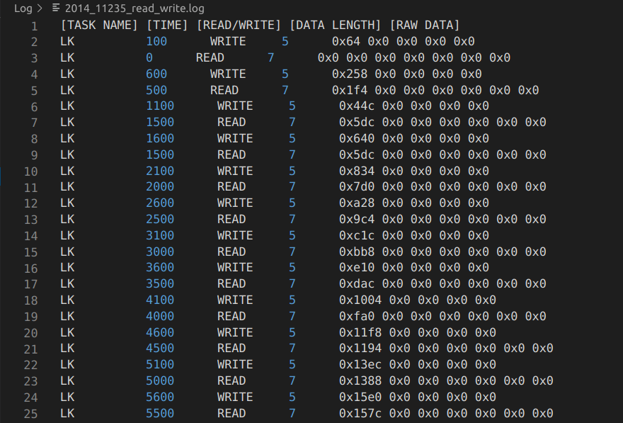
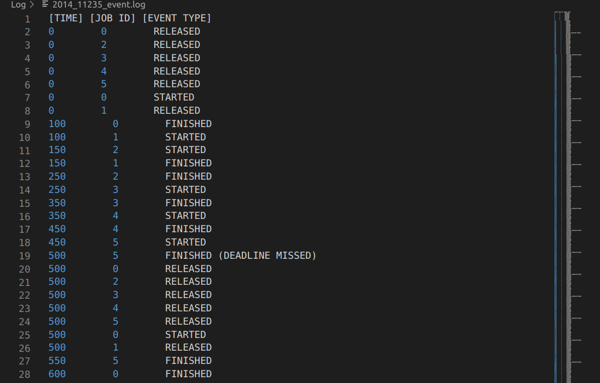

# Report 2

## Case #1: Log task read/write
### 1. Files Modified
`Job.cpp`: Used logger function to log read/write event for the target task   
`Logger.cpp`: Implemented logger function   
`Logger.h`: Added logger function

### 2. Explanation
The function which I modified to log data was called `Job:run_function()` in `Job.cpp` files. This function basically checks if the current job is read or write, then runs the job. Therefore, it was the perfect place to log read or write event for a target task. Since I can get the current job's name by `this->get_task_name()`, I can compare it with the target task name. If it is the same, I can log in to the file. 

There was a total of 5 data that I needed to log. The `name` data was obviously the easiest to get because I can get it from `utils::log_task`. I was able to get the time, raw_data, and data_length through `current_data` or `delated_data`. If it was a read job, `current_data` was used to get the data, and if it was a write job, `delayed_data` was used to get the data. I was able to figure out if it was a read or write data through `get_is_read()` and `get_is_write()` functions.

### 3. Output

## Case #2: Log event
### 1. Files Modified
`Executor.cpp`: `run_simulation` function was modified   
`Logger.cpp`: `start_logging()` function was modified, and a logger function was implemented   
`Logger.h`: mutex and vector of `ScheduleData` was initialied

### 2. Explanation
The perfect place to log events was `run_simulation` function. This function basically iterates all the jobs and schedules the jobs by setting their start, execution, finish time. It also checks for deadline miss. 

`run_simulation` function first checks for a deadline miss. Therefore, this was the perfect place to log dead_line miss jobs. I got the time and task_id from the job's `get_actual_deadline()` and `get_task_name()` functions, then I passed it to the logger function. The function then iterates through the jobs and sets simulated release time. This was the place I passed release time to the logger function. Finally, the function iterated jobs from `simulation_ready_queue` to set simulated start and finish time. This was the perfect place where I passed start and finish time of the jobs.

The problem with the above method was that the log was not in order. Sometimes events with faster time was logged later in the file. In order to fix the problem, I imitated the `start_logging` method. `start_logging` basically saved all the events in a vector and whenver there were more than 10 events in the vector, it logged the event with the smallest time. This way all the logged events will be in order.

First, I created a vector of `ScheduleData` objects to save all the events in the `Logger.h` file. `ScheduleData` was used in `start_logging` method, but because it saves 2 integer values and 1 string value, it was the perfect data structure to save all the data I needed to log. After saving events in a vector through logger function, I modified `start_logging` function. I copied the code in `start_logging` method and used it to make my own log. Whenever there were more than 30 events in the vector, the function logged the event that has the fastest time. Finally, I had to surround the code with mutex to prevent data race or any kind of synchronization problem. 

### 3. Output
The following screenshot shows events of real cyber system that have deadline missed events. We can see that all 6 events are released at time 0. Job 0 first starts and finishes at time 100. Then Job 1 starts and finishes at time 150, and so on.

