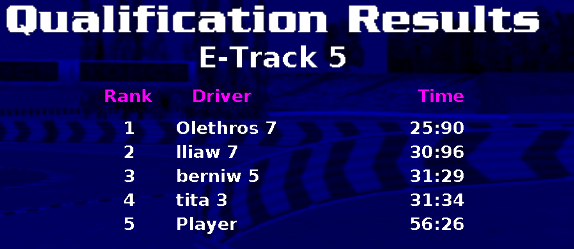
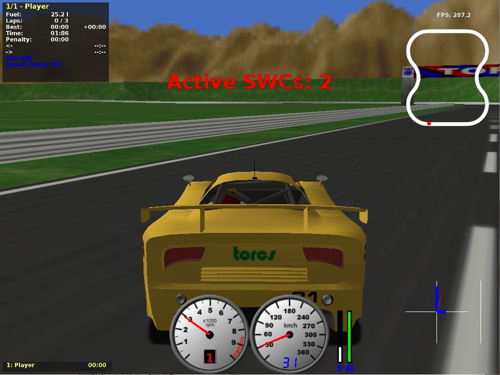
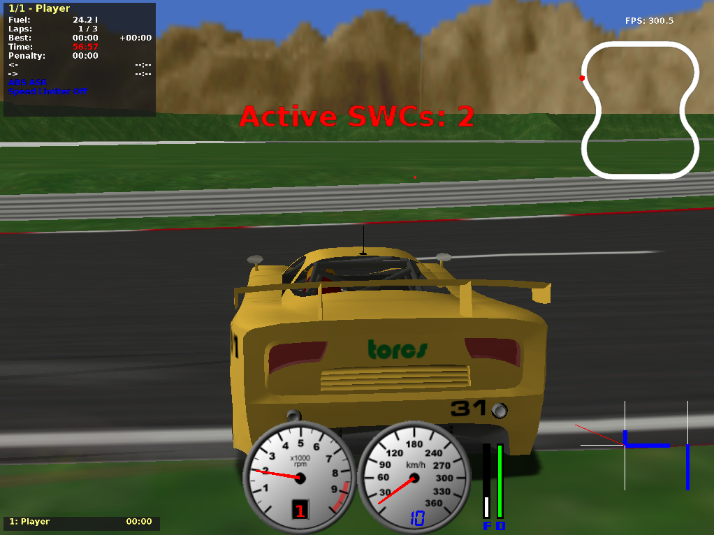

# Report for Final Project #1
- Name: BAEK Woohyeon
- Student ID: 2017-15782
## Final Parameter Setting
- Target Speed: 100 km/h
- Left and Right Steering Value: 3000
- Task Period
	+ CC: 280
	+ LK: 40
	+ SENSING: 280
	+ BRAKE: 280
	+ POWER: 280
	+ LOCAL: 280
- Task Execution Time
	+ CC: 28
	+ LK: 20
	+ SENSING: 28
	+ BRAKE: 28
	+ POWER: 28
	+ LOCAL: 28
## Result
56.26 seconds on E-Track 5

## Conclusion
I got a higher speed than the baseline.
- - -
## Explanation
### Baseline
- Target Speed: 140 km/h
- Left and Right Steering Value: 10000
- Task Period
	+ CC: 500
	+ LK: 500
	+ SENSING: 500
	+ BRAKE: 500
	+ POWER: 500
	+ LOCAL: 500
- Task Execution Time
	+ CC: 50
	+ LK: 50
	+ SENSING: 100
	+ BRAKE: 100
	+ POWER: 100
	+ LOCAL: 100
### First Try
I found that SENSING, BRAKE, POWER, LOCAL modules do nothing on the car. Therefore, I set their execution time to 50, keeping their periods. I also observed that the car crossed the line because of delayed execution of LK tasks. To reduce period while keeping utilization low, period was set to 251 and execution time to 25.1.
- Task Period
	+ LK: 251
- Task Execution Time
	+ LK: 25.1
	+ SENSING: 50
	+ BRAKE: 50
	+ POWER: 50
	+ LOCAL: 50
### Second Try
Even though the period of LK tasks decreased, the car still crossed the line. I again reduced the period to 101 and set the execution time as 20.2.
- Task Period
	+ LK: 101
- Task Execution Time
	+ LK: 20.2
### Third Try
The car stopped and did not go forwards. It seemed it was because the LK tasks dominated the system and influence of CC tasks became small. I then set the parameters of CC the same as ones of LK.
- Task Period
	+ CC: 101
- Task Execution Time
	+ CC: 20.2
### Forth Try
The car worked, but it fluctuated on the straight line. This made the car unstable and skidded on the road. I thought it is because the steering values and speeds are too high. I rearranged as follow.
- Target Speed: 100 km/h
- Left and Right Steering Value: 3000

### Final Try
The car went well, but after one or two laps, it did not respond to the corners of the track and hit the wall. I had to reduce the period of LK more. If the period goes to the range of (0, 100], the utilization must be at least 50. The utilization of the other five kinds of tasks should be 10. That means, they should be in the range of (250, 500]. Moreoever, for all kinds of tasks, the periods should be multiples of others having shorter periods. For all five tasks: CC, SENSING, BRAKE, POWER, LOCAL, their periods cannot be the multiples of the others, so they all should have the same periods that are the multiples of the period of LK. Execution time of all tasks are larger or equal than 20. Choosing the shortest periods while meeting these constraints, I chose the parameter as follow.
- Task Period
	+ CC: 280
	+ LK: 40
	+ SENSING: 280
	+ BRAKE: 280
	+ POWER: 280
	+ LOCAL: 280
- Task Execution Time
	+ CC: 28
	+ LK: 20
	+ SENSING: 28
	+ BRAKE: 28
	+ POWER: 28
	+ LOCAL: 28