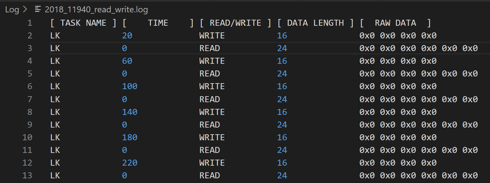
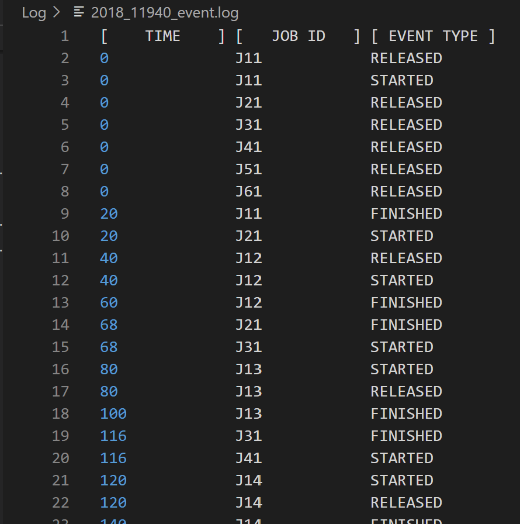
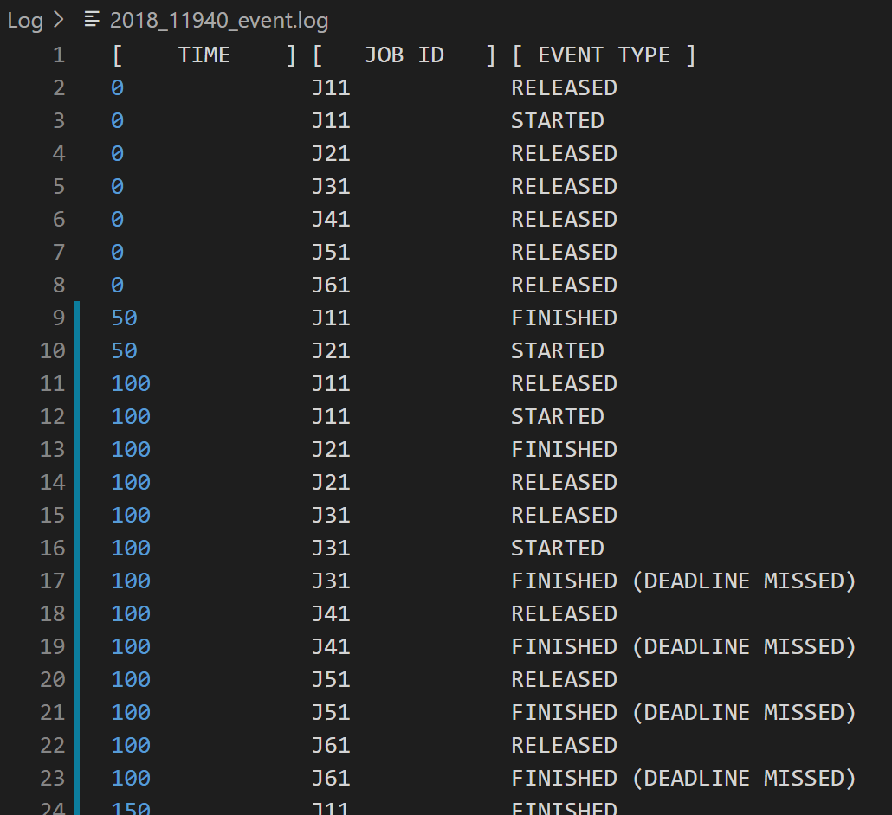

# Computer Modeling Final Project #2

Seoul National University

Dept. of Computer Science and Engineering

Seonghwan Choi
# Write down where did you put logger functions and why for case #1 and #2.

## 0. Overall
- 수정한 파일은 아래와 같다.
  > `Logger.h` / `Logger.cpp` for logging function
  > `Job.cpp` for logging read/write of tasks
  > `Executor.cpp` for logging events of real cyber system

- log 파일(`path/to/cpsim/Log/2018_11940_{read_write|event}.log`, )은 `Logger`가 생성될 때 함께 생성되며, 본 과제에서 구현한 logger function이 호출될 때 파일이 열려 log가 한 entry 단위로 작성되는 구조이다.

## 1. Case#1 Implementation

- 첫 번째 case를 위한 logging function은 `_2018_11940_task_read_write_logger`이며, `Job.cpp`에서 read나 write할 때 실행된다.
- 따라서 `run_function` 함수의 아래 부분에 삽입되어 실행된다.

  > - `read`, `write`할 때: read, write에 대한 log를 각각 추가
  > - `read`만 할 때: read에 대한 log를 추가
  > - `write`만 할 때: write에 대한 log를 추가

- 위의 네 부분의 코드 구조는 기본적으로 동일하다. logging function은 `Job.cpp`에서 현재 target job이 logging하고자 하는 task의 job과 일치하면 `logger`의 log entry generator(`_2018_11940_gen_read_log_entry`, `_2018_11940_gen_write_log_entry`)을 호출하여 현재 상태에 맞는 log entry를 생성하고, 이를 `_2018_11940_task_read_write_logger`에 인자로 넘겨 파일에 entry를 추가하도록 한다.
- log entry generator(`_2018_11940_gen_read_log_entry`, `_2018_11940_gen_write_log_entry`)에서는 인자로 넘겨받은 target job의 raw data와 size, task name, r/w 여부를 string 형태의 log entry로 만들어 반환한다.
- `_2018_11940_task_read_write_logger`에서는 string 형태로 넘겨받은 log entry를 실제 파일에 추가한다.

## 2. Case#2 Implementation

- 두 번째 case를 위한 logging function은 `_2018_11940_real_cyber_event_logger`이며, `Executor.cpp`에서 job이 release, start, finish(정상 종료 || deadline miss)될 때 실행된다.
- 따라서 `run_simulation` 함수의 아래 부분에 삽입되어 실행된다.

  > - `deadline miss` 발생 시: 원래의 deadline 시간과 함께 job id, `FINISHED (DEADLINE MISSED)`를 log에 추가
  > - `release`, `start`, `finish`: 각각 해당하는 actual time들과 함께 job id, `RELEASED`|`STARTED`|`FINISHED`를 log에 추가

- 위의 네 부분의 코드 구조는 기본적으로 동일하며, logging 대상 항목의 수가 적고 파싱이 쉬우므로 log entry 생성 함수를 별개로 두지 않고 `_2018_11940_real_cyber_event_logger` 함수에서 모든 것을 처리한다.
- simulation의 실행 순서는 실제 실행 순서와 반드시 동일한 것은 아니다. 따라서 `Logger/start_logging` 함수와 같이 logging entry를 buffer 형태로 보관하다가 일정 길이가 되면 시간 순서대로 파일에 작성하는 로직이 필요하다. 본 구현에서는 C++ STL의 priority queue를 이용하여 이 로직을 구현하였다.
- priority queue에 들어갈 `event_entry` 구조체와 custom compare function을 구현하였다. compare function은 우선적으로 time에 대해 오름차순, 이후 job id에 대해 오름차순으로 하였다.
- 이후 priority queue로 선언된 `event_entry_buffer`의 길이가 50을 넘으면 `event_entry_buffer`에서 pop한 logging entry를 파일에 작성한다.
- 이를 통해 시간에 대해 정렬된(부가적으로 job id에 대해서도 정렬된) log 출력을 얻을 수 있다.

- 아래는 Deadline 위반이 발생하지 않은 경우의 결과이다.

- 아래는 Deadline 위반이 발생한 경우의 결과이다.

